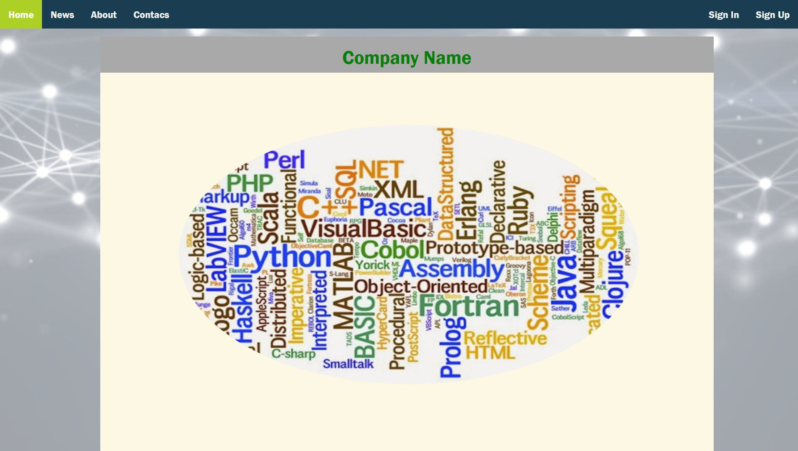
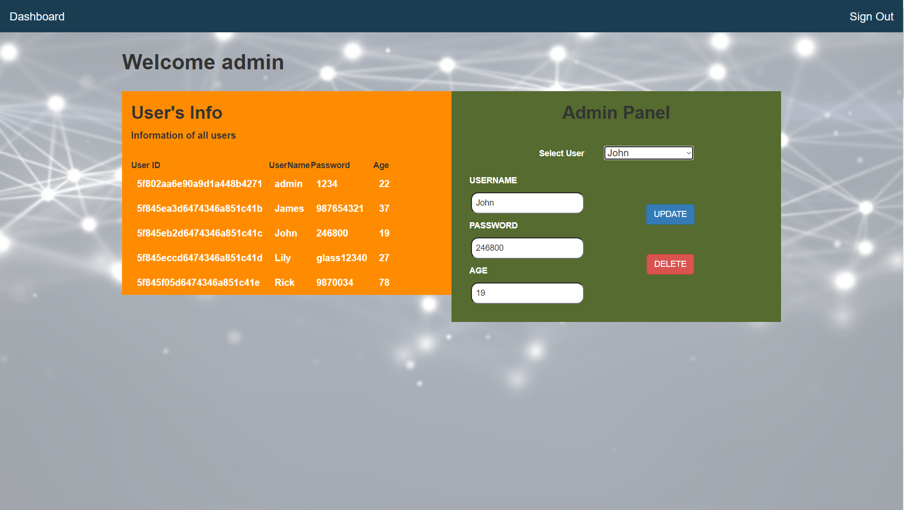
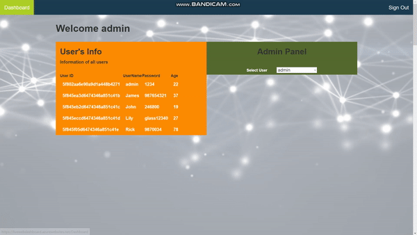

<h1>LiveWebDashboard</h1>
The reason I write this project is to develop myself in the .Net MVC field.
There is a Landing page and a Dashboard page in my project.
The Landing page has six sections: Home, News, About, Contact and SignIn, SignUp.
In the Dashboard page, there are two main sections, Users Info and Admin Panel.

<h3>Development Environments and Dependency</h3>
While writing this project, I used the 2019 model of visual studio and the 4.7.2 version of .Net Framework. 
I used Mongo DataBase as a database in the project.

<h3>Added Features</h3>
<h5>Sign Up</h5>
If the username or password is not less than 3 characters; 
If two passwords you entered match with each other; 
If you are 18 or over 18 years old; 
If the username you entered has not been taken before; 

You will register successfully and your information will be successfully written into the database.

<h5>Sign In</h5>
After you register, if your username and password are not wrong,  
your information is read from the database and ,you can log in without any problems.

<h5>Dashboard Side</h5>
Firstly, You do not have permission to access the Dashboard unless you are logged in. 
I provided this structure using cookies.
Thanks to the cookies used, as long as there is no exit, even if the page is exited, when the page is returned, it is found as logged in. 
The "Welcome Username" expression you see when you enter the dashboard is also written thanks to the cookies.  

After selecting any user in the Admin Panel, you will see that user's information and two buttons.

<h5>Delete Function</h5>
It deletes the information of the user you selected from the database and a warning message appears before deleting.

<h5>Update Function</h5>
After clicking the button, it updates the user information you changed. And before updating, a warning message appears on the screen.   

Link of my project uploaded to Microsoft Azure : https://livewebdashboard.azurewebsites.net   
The Landing Page
 
The Dashboard Page
 
The Gif of My Project
  

Thanks for looking!
